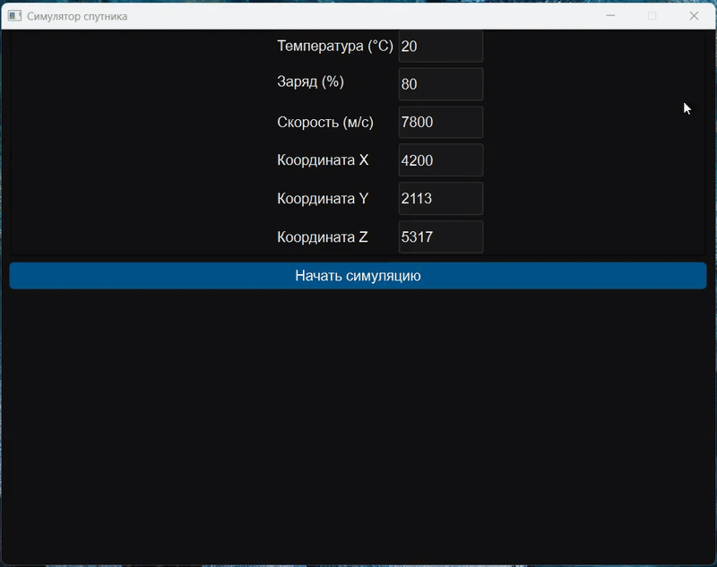

# SatelliteSim 🚀

> **Qt/C++ симулятор спутника с телеметрическими данными**

<p align="center">
  <!-- Здесь можно добавить гифку с демонстрацией работы -->
  
</p>

---

## 🛰️ Описание проекта

Программа моделирует работу спутника, собирает и анализирует:
1. **Телеметрические данные**  
   - Состояние (норма / авария) по температуре и заряду  
   - Позицию (координаты X, Y, Z)  
   - Скорость движения  
   - Температуру (диапазон –300 … +3000 °C)  
   - Уровень заряда батареи (0 – 100 %, критический < 20 %)

2. **Вычисления**  
   - Время до полной зарядки

3. **Передача данных**  
   - Асинхронный TCP-клиент отправляет строку  
     ```
     STATE=<Норма|Авария>;POS=X,Y,Z;SPD=<скорость>;TEMP=<°C>;CHG=<%>
     ```
   - По умолчанию подключается на `127.0.0.1:12345`

4. **Логирование**  
   - Все события (старт, расчёты, отправка, ошибки) с таймштампами  
   - Предупреждения при выходе параметров за нормы

---

## ✨ Функциональные возможности

- Ввод начальных параметров спутника  
- Расчёт времени до полного заряда  
- Автоматическая отправка телеметрии по TCP  
- Цветная тёмная тема
- Детальная запись в окно логов  

---

## ⚙️ Принцип работы

1. **Инициализация**  
   - Создаётся `QApplication` и загружается стилизация через `setStyleSheet()`.  
   - Конфигурируется форма из `mainwindow.ui`, создаётся TCP-сокет.

2. **Ввод и проверка**  
   - Пользователь вводит: температура, заряд, скорость и координаты.  
   - Срабатывает слот `on_startButton_clicked()`.  
   - Данные читаются из `QLineEdit`, конвертируются в `double`.  
   - Вызывается `checkState()`: проверка нормальности параметров → статус «Норма»/«Авария».

3. **Вычисления**  
   - `calcChargeTime()` возвращает время (в секундах) до 100 % заряда.  
   - Все этапы логируются через `logMessage()` с текущим `QDateTime`.

4. **Отправка по TCP**  
   - `socket->connectToHost()` устанавливает соединение с приёмником.  
   - При срабатывании `connected()` вызывается `onSocketConnected()`, который:
     1. Берёт последнюю строку лога  
     2. Преобразует в UTF-8 и шлёт в сокет  
     3. Кратко логирует результат и отключается

5. **Обработка ошибок**  
   - При любой ошибке сети (`errorOccurred`) вызывается `onSocketError()`.  
   - В лог пишется подробное описание `socket->errorString()`.
